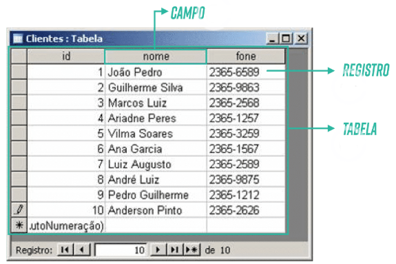
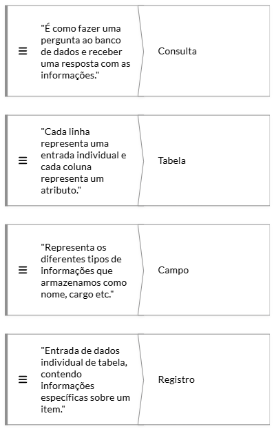
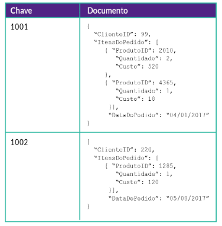
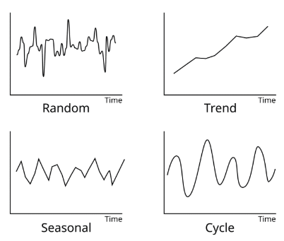

# Introdução Aos Fundamentos de Banco de Dados

## Porque explorar os dados?
Os dados são o alicerce sobre o qual construímos sistemas de informação robustos e eficazes.  Ao compreender como os dados são estruturados e gerenciados, estaremos preparados para enfrentar os desafios de software e da análise de dados com confiança e habilidade.

## História dos Banco de Dados
Lá nos primórdios da tecnologia, quando os computadores eram gigantes e ocupavam salas inteiras. Os dados eram armazenados em cartões perfurados e fitas magnéticas e a organização de informações era uma verdadeira proeza. 

- 1970: Edgar F. Codd propôs um novo modelo de banco de dados - o banco de dados relacional. Ao invés de estruturas complexas, Codd propôs uma abordagem baseada em tabelas e relações matemáticas simples. 
- Bancos de Dados Não Relacionais (NoSQL): Projetados para lidar com grandes volumes de dados não estruturados ou semiestruturados, esses sistemas oferecem flexibilidade e escalabilidade para cenários de aplicação específicos, como Big Data e computação em nuvem.

## Principais conceitos de banco de dados

### CONSULTA
Interagir com um banco de dados requer consultas. Como recuperar, inserir, atualizar ou excluir dados de uma tabela.

- **Campo:** é a coluna da tabela, uma categoria específica de dados
- **Registro:** é uma linha da tabela, uma entrada individual de dados em uma tabela.
- **Tabela:** organizam dados em linhas e colunas, onde cada uma representa uma entrada única de dados e cada coluna representa um atributo particular dos dados.

## Conhecendo a variedade de banco de dados

- **Bancos de Dados Relacionais:** são baseados no modelo relacional, organizam os dados em tabelas, oferecendo estrutura e consistência. Amplamente utilizados em sistemas que exigem transações complexas e integridade de dados.
- **Bancos de Dados NoSQL:** alternativa aos bancos relacionais para lidar com grandes volumes de dados e ambientes distribuídos. Flexíveis e altamente escaláveis, ideias para aplicativos da web, análise de big data e sistemas de alta disponibilidade.

- **Bancos de Dados de Gráficos:** projetados para representar e consultar relacionamentos complexos entre dados, são essenciais para aplicações como redes sociais, sistemas de recomendação e análise de redes.
- **Bancos de Dados de Séries Temporais:** especializados em armazenar e analisar dados que variam ao longo do tempo, são ideias para monitoramento de sensores, registros de eventos e análise de desempenho.

---
📌 Este material é destinado a fins educacionais e introdutórios.