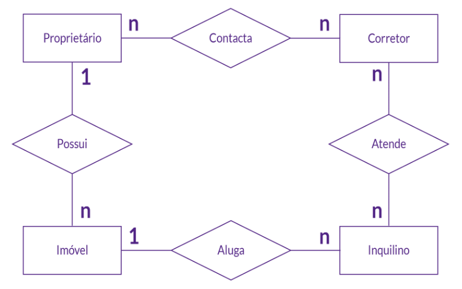
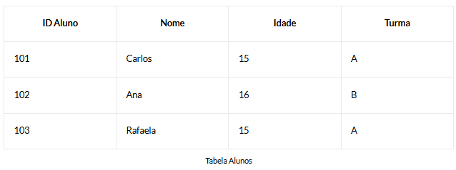

# Fundamentos de banco de dados
## INTRODUÇÃO
O Modelo Entidade-Relacionamento (MER) é como um mapa que mostra como as informações se conectam dentro do banco de dados. Uma forma comum de visualizar um MER é por meio de um diagrama, onde as entidades são representadas por retângulos e os relacionamentos por linhas que as conectam.

## MODELO ENTIDADE-RELACIONAMENTO
O **Modelo Entidade-Relacionamento**, ou MER, é uma ferramenta fundamental usada por designers de banco de dados para planejar como as informações serão armazenadas e como elas se relacionam entre si. Ele utiliza conceitos simples que **representam objetos do mundo real e suas interações.**

- Informações organizadas de forma a facilitar seu acesso e recuperação.
- As coisas importantes do mundo real são pensadas como **entidades.**
- Cada entidade possui **atributos** específicos, como nome, idade e número de identificação
- As entidades em um MER podem se relacionar entre si.
- Esses **relacionamentos** nos ajudam a entender como diferentes partes do banco de dados estão conectadas.

O MER é essencial no desenvolvimento de sistemas de banco de dados, pois nos ajuda a entender como as informações devem ser organizadas. Ele nos permite planejar e projetar o banco de dados de forma a tornar fácil adicionar, modificar e acessar dados quando necessário.

## TIPOS DE RELACIONAMENTOS
As conexões em um banco de dados são chamadas de relacionamentos e são como as pontes que ligam diferentes partes do nosso banco de dados.

- **Relacionamento "Um para um" (1:1):** é mais raro, mas às vezes é útil quando queremos garantir que cada coisa tenha sua própria correspondência exclusiva. 
- **Relacionamento "Um para muitos" (1:N):** é muito comum e útil para situações em que uma coisa pode ter várias conexões, mas cada conexão leva a apenas uma outra coisa.
- **Relacionamento "Muitos para muitos" (N:N):** essa abordagem nos permite lidar com situações complexas de forma clara e eficiente, garantindo que todos os relacionamentos entre x e y sejam facilmente compreendidos e gerenciados. Como exemplo, agora, vamos imaginar um aplicativo de planejamento de festas, em que várias pessoas podem participar de vários eventos.

## TABELAS DE BANCO DE DADOS
Uma tabela em um banco de dados é como uma caixa organizada que guarda informações de forma estruturada e acessível. Uma tabela é dividida em linhas e colunas, onde cada linha representa um registro específico e cada coluna é um campo que armazena um tipo específico de informação.

- **Colunas (campos):** as colunas são os componentes verticais de uma tabela e representam os diferentes tipos de informações que são armazenadas para cada registro. Cada coluna desempenha um papel fundamental na estruturação e organização dos dados em uma tabela.
- **Linhas (registros):** cada linha em uma tabela é como uma entrada única de dados, contendo informações específicas sobre um item, pessoa ou evento. Esses registros são essenciais para organizar e acessar dados de maneira eficiente.

## DIAGRAMAS DE TABELAS
Os **diagramas de tabelas**, especialmente os **Diagramas de Entidade-Relacionamento (DER), são como mapas que nos guiam pelo labirinto de dados de um banco de dados.** Enquanto as tabelas são a base, os diagramas são como a imagem completa, mostrando não apenas as tabelas em si, mas também os relacionamentos entre elas.

## SÍNTESE
- Diagramas de tabelas: são uma ferramenta essencial para visualizar e compreender a estrutura dos dados em um banco de dados. Eles nos fornecem uma perspectiva mais ampla e nos ajudam a identificar padrões e relacionamentos que podem não ser imediatamente óbvios ao examinar apenas as tabelas individualmente.
- Atributos: são as características individuais que definem e descrevem os dados armazenados em uma tabela. Cada atributo desempenha um papel vital na identificação e diferenciação dos registros, fornecendo informações precisas sobre cada entrada. 

---
📌 Este material é destinado a fins educacionais e introdutórios.