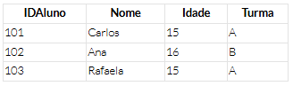
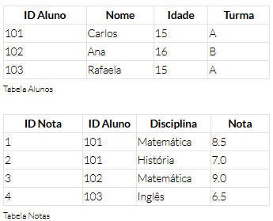
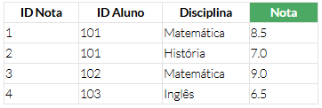

# Conceito de chaves
## Atributos em bancos de dados: definindo características
Em um banco de dados, cada dado é descrito por atributos específicos que ajudam a diferenciá-lo e classificá-lo.

#### CHAVE PRIMÁRIA
A chave primária identifica unicamente cada registro na tabela. Geralmente, é representada por uma coluna com valores únicos, como um número sequencial ou um código único. Abaixo um exemplo com a coluna **_IDAluno_**:

#### CHAVE ESTRANGEIRA
A chave estrangeira é como uma referência cruzada, ela estabelece uma relação entre duas tabelas, armazenando valores que correspondem à chave primária de outra tabela. Isso permite conectar informações de diferentes tabelas e criar relacionamentos entre elas.

Na segunda tabela, a coluna "ID Aluno" desempenha um papel especial como chave estrangeira. Ela atua como ponte entre essa tabela e a outra. Dessa forma, cada entrada nessa tabela de notas está vinculada a um aluno específico popr meio do seu ID. Isso nos permite rastrear não apenas as notas, mas também relacioná-las diretamente aos alunos aos quais pertencem.

#### ATRIBUTOS DESCRITIVOS
Esses atributos fornecem informações detalhadas sobre os dados que ajudam a entender e organizar melhor os dados armazenados na tabela.

#### ATRIBUTOS NUMÉRICOS
Os atributos numéricos, por sua vez, representam valores quantitativos. Esses atributos são essenciais para realizar cálculos, análises e operações matemáticas nos dados do banco de dados.

## CHAVE PRIMÁRIA
Reforçando o conceito de chave primária: em um banco de dados, a chave primária é uma coluna (ou conjunto de colunas) que serve para identificar de forma única cada linha na tabela. Ela garante que não haja duplicatas na tabela e que cada registro possa ser identificado de maneira única.

A chave primária precisa respeitar certas características para ser configurada corretamente, como:

- **Unicidade:** cada valor na chave primária deve ser único em toda a  tabela. Isso significa que não pode haver dois registros com o mesmo valor na chave primária.
- **Não nulidade:** a chave primária não pode ter valores nulos. Cada registro deve ter um valor válido na chave primária.
- **Imutabilidade:** uma vez definida, a chave primária não deve ser alterada. Isso garante a integridade dos dados e a consistência das relações entre as tabelas.

Fora as características básicas, devemos também compreender as importâncias fundamentais das chaves primárias, como:

- **Identificação única:** as chaves primárias garantem que cada registro na tabela seja identificado de forma única. Isso facilita a recuperação e a manipulação dos dados, garantindo que você possa encontrar e trabalhar com informações específicas de forma rápida e eficiente.
- **Integridade dos dados:** ao evitar duplicatas e inconsistências, as chaves primárias desempenham um papel crucial na manutenção da integridade dos dados. Elas garantem que as informações armazenadas sejam precisas e confiáveis, fornecendo uma base sólida para análises e tomadas de decisão.
- **Relacionamentos entre tabelas:** nas relações entre diferentes tabelas, as chaves primárias são usadas como pontos de referência. Por exemplo, em uma relação de muitos para um, a chave primária em uma tabela é referenciada como uma chave estrangeira em outra tabela. Isso permite estabelecer conexões significativas entre os dados e construir sistemas de banco de dados mais robustos e flexíveis.

## CHAVES ESTRANGEIRAS
Características e importância:

- **Relacionamento entre tabelas:** a chave estrangeira é usada para estabelecer um relacionamento entre duas tabelas em um banco de dados.
- **Restrição de integridade referencial:** ela garante que os valores na coluna da chave estrangeira correspondam a valores existentes na chave primária da tabela relacionada, mantendo a integridade dos dados.
- **Múltiplas chaves estrangeiras:** uma tabela pode conter várias chaves estrangeiras, estabelecendo relacionamentos com várias outras tabelas.

Além das características, temos o papel fundamental, qual é sua importância. Seria ela menos crucial que a chave primária? A resposta é não. Entenda por quê:

- **Integridade dos dados:** elas garantem a integridade referencial entre tabelas, evitando inconsistências e garantindo a precisão dos dados.
- **Manutenção da consistência:** as chaves estrangeiras garantem que os relacionamentos entre tabelas sejam mantidos corretamente durante operações de inserção, atualização e exclusão de dados.

## INTEGRIDADE REFERENCIAL
Em termos simples, a integridade referencial em um banco de dados refere-se à consistência e à precisão das relações entre tabelas relacionadas. Ela garante que todas as relações entre chaves primárias e chaves estrangeiras estejam mantidas corretamente, evitando inconsistências ou referências a dados inexistentes. A integridade referencial é implementada por meio de chaves primárias e chaves estrangeiras. Quando uma chave estrangeira em uma tabela faz referência a uma chave primária em outra tabela, a integridade referencial é estabelecida. Isso significa que qualquer valor na coluna da chave estrangeira deve corresponder a um valor válido na coluna da chave primária da tabela relacionada.

**E qual é a importância da integridade referencial?**

- **Consistência dos dados:** garante que as relações entre os dados sejam consistentes e precisas, evitando referências a dados inexistentes ou inválidos.
- **Integridade dos relacionamentos:** mantém a integridade e a validade dos relacionamentos entre tabelas, evitando associações incorretas ou ambíguas entre os dados.
- **Prevenção de inconsistências:** ajuda a prevenir erros de inserção, atualização ou exclusão de dados que possam resultar em inconsistências ou corrupção dos dados.