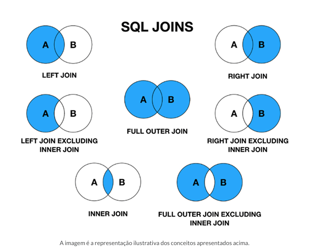

# SQL, o que é?
## INTRODUÇÃO
Com o SQL, você pode construir e ajustar a estrutura dos bancos de dados, definindo tabelas, índices e outras peças importantes para organizar suas informações. Para encontrar dados existem comandos como SELECT, FROM e WHERE. Comandos como INSERT, UPDATE e DELETE permitem adicionar, modificar e excluir registros das tabelas conforme necessário.
Além disso, o SQL é seu parceiro para realizar análises profundas nos dados, calculando totais, médias, desvios padrão e outras estatísticas importantes para lhe ajudar a tomar decisões embasadas. 
O SQL é a cola que une sistemas e aplicações, permitindo que eles se comuniquem com os bancos de dados para armazenar, recuperar e manipular dados de maneira eficiente.

## PRINCÍPIOS DO SQL (Structure Query Language)
- **Estruturação dos comandos:** aqui, a organização é a chave. Os comandos SQL são meticulosamente estruturados em cláusulas, cada uma com sua função específica.
- **Sintaxe e semântica:** imagine a sintaxe como a gramática do SQL. Cada comando segue regras precisas para garantir que seja compreendido e executado corretamente pelo banco de dados.
- **Interoperabilidade:** aqui reside uma das maiores forças do SQL. Sua capacidade de ser amplamente suportado por diferentes sistemas de gerenciamento de banco de dados (SGBDs) torna-o uma escolha poderosa para desenvolvedores e administradores de banco de dados. Isso significa que o código SQL escrito para um SGBD específico pode ser facilmente transferido para outro, sem a necessidade de grandes modificações. Essa interoperabilidade é crucial em ambientes onde a portabilidade e a compatibilidade são essenciais.

## PRINCIPAIS COMPONENTES DO SQL
- **DDL:** CREATE, ALTER, DROP, ALTER, RENAME, TRUNCATE, COMMENT.
- **DML:** INSERT, UPDATE, DELETE, MERGE, CALL, EXPLAIN PLAN, LOCK TABLE.
- **DQL:** SELECT.
- **DCL:** GRANT, REVOKE.
- **TCL:** COMMIT, ROLLBACK, SAVEPOINT, SET TRANSACTION.

#### DDL
A **DDL** é a arquiteta do nosso banco de dados. A responsabilidade por construir e alterar a estrutura de nosso banco de dados recai sobre ela.
- CREATE TABLE: criar uma tabela. Você especifica o nome da tabela e, em seguida, lista as colunas que deseja incluir, juntamente com o tipo de dados que cada coluna pode armazenar. Por exemplo:
```
CREATE TABLE clientes (
    id INT AUTO_INCREMENT PRIMARY KEY,
    nome VARCHAR(50),
    idade INT,
    email VARCHAR(100)
);
```
- ALTER TABLE: se precisar fazer alterações na estrutura de uma tabela existente, você usa o comando ALTER TABLE. Por exemplo, se quiser adicionar uma nova coluna à tabela “clientes”, pode fazer assim:
```
ALTER TABLE clientes
ADD COLUMN telefone VARCHAR(20);
```

- DROP TABLE: se precisar remover uma tabela completamente do seu banco de dados, você pode usar o comando DROP TABLE. Por exemplo:
```
DROP TABLE clientes;
```


#### DML
Depois disso, temos a DML, que funciona como um trabalhador que mexe diretamente nos dados de nossa tabela. 
- INSERT INTO: pode ser usado para adicionar novos registros  a uma tabela existente no seu banco de dados. Você especifica o nome da tabela e, em seguida, lista os valores que deseja adicionar para cada coluna. Por exemplo:
```
INSERT INTO clientes (nome, idade, email)
VALUES (‘João’, 30, ‘joao@email.com’);
```

- UPDATE: podem ser usados para alterar informações já existentes. Por exemplo, se quiser alterar o e-mail de um cliente chamado “João”, pode fazer assim:
```
UPDATE clientes
SET email = ‘joao.novo@email.com’
WHERE nome = ‘João’;
```

- DELETE FROM: remoção de dados.  Por exemplo, se quiser excluir o registro do cliente “João” da tabela “clientes”, pode fazer assim:
```
DELETE FROM clientes
WHERE nome = ‘João’;
```

#### DQL
A DQL funciona como nosso próprio detetive. Ao fazer perguntas específicas ao nosso banco de dados, ela nos ajuda a obter as respostas de que precisamos.
- SELECT: buscar dados de uma ou mais tabelas e aplicar filtros para encontrar o que buscamos. Você pode especificar quais colunas deseja recuperar e aplicar filtros para limitar os resultados. Por exemplo:
```
SELECT nome, idade
FROM clientes
WHERE cidade = ‘São Paulo’;
```

Este comando irá recuperar os nomes e idades de todos os clientes que moram em São Paulo, por exemplo. Além disso, você pode usar cláusulas adicionais para refinar ainda mais sua consulta:
- WHERE: permite aplicar condições para filtrar os resultados com base em critérios específicos.
- ORDER BY: permite classificar os resultados em ordem ascendente ou descendente com base em uma ou mais colunas.
- GROUP BY: agrupa os resultados com base nos valores de uma ou mais colunas.
- HAVING: permite aplicar condições de filtro a grupos criados pela cláusula GROUP BY.


Resumindo, a DDL nos ajuda a construir a casa (ou seja, a estrutura do banco de dados), a DML nos ajuda a decorar cada cômodo (ou seja, manipular os dados) e a DQL nos ajuda a encontrar o que estamos procurando dentro dessa casa. Com a DDL, você pode criar e modificar a estrutura do seu banco de dados. Isso inclui a criação de tabelas para armazenar seus dados, a definição das colunas dentro dessas tabelas e a especificação de quais tipos de dados cada coluna pode armazenar.

#### OPERAÇÃO JOIN 
A operação chamada JOIN é um comando que une informações para consulta de dados de múltiplas tabelas.

- **INNER JOIN:** este é como um encontro perfeito! Ele retorna apenas as linhas que têm correspondências nas duas tabelas, ou seja, apenas os dados que têm algo em comum.
- **LEFT JOIN:** aqui é como abrir uma porta. Retorna todas as linhas da tabela à esquerda e as correspondentes da tabela à direita, ou NULL se não houver correspondência. É como convidar todos para a festa, mesmo que alguns convidados não apareçam.
- **RIGHT JOIN:** é parecido com o LEFT JOIN, mas inverte os papéis. Retorna todas as linhas da tabela à direita e as correspondentes da tabela à esquerda, ou NULL se não houver correspondência.
- **FULL JOIN:** este é como ter todos os ingredientes na receita, não importa de onde eles venham. Retorna todas as linhas quando há uma correspondência em uma das tabelas.



---

## Exemplo: 
Considere a situação em que você tem duas tabelas: “clientes” e “pedidos”. Todos os pedidos estão relacionados a um cliente, não é? Você pode usar um INNER JOIN para ver os detalhes do pedido, incluindo o nome do cliente. Juntar peças de quebra-cabeça para ver a imagem completa é semelhante 
a isso. Imagine que temos informações de clientes como nome, endereço e telefone em uma tabela. Além disso, a tabela “pedidos” contém informações como número, data e valor total, além de uma coluna “id_cliente” que representa o cliente. Você pode usar um INNER JOIN para unir essas duas tabelas se quiser ver o nome do cliente e os detalhes do pedido. É como ligar os clientes aos pedidos. 

```
SELECT clientes.nome, pedidos.numero_pedido, pedidos.data, pedidos.valor_total
FROM clientes
INNER JOIN pedidos ON clientes.id = pedidos.id_cliente;
```

Aqui, você está selecionando o nome do cliente da tabela “clientes” e o número do pedido, a data e 
o valor total da tabela “pedidos”. Depois, você usa o INNER JOIN para unir as duas tabelas com base 
na condição de que o “id” do cliente na tabela “clientes” seja igual ao “id_cliente” na tabela “pedidos”.
Assim, você obtém uma lista que mostra o nome de cada cliente junto com os detalhes de todos os 
pedidos que ele fez.

---

---
📌 Este material é destinado a fins educacionais e introdutórios.