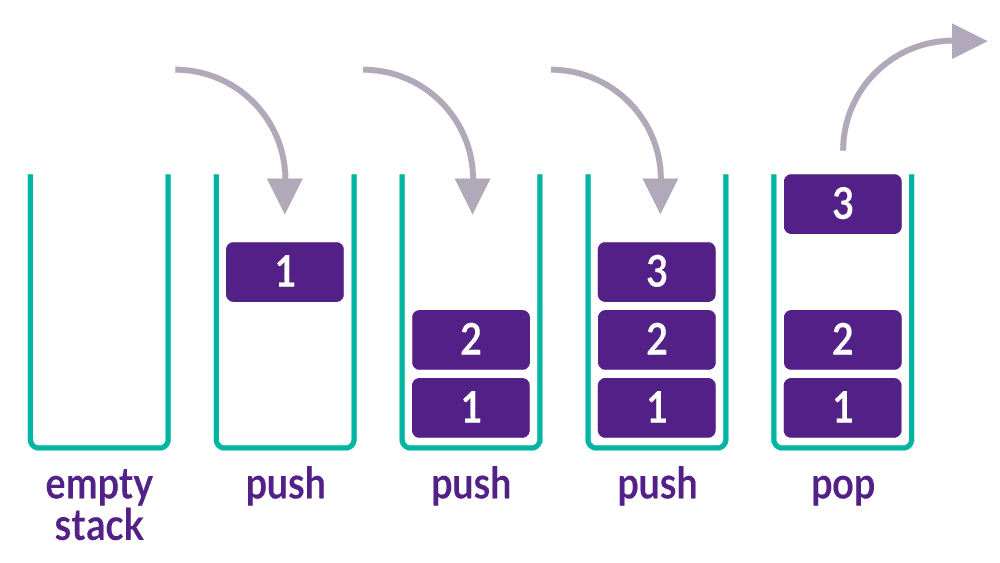
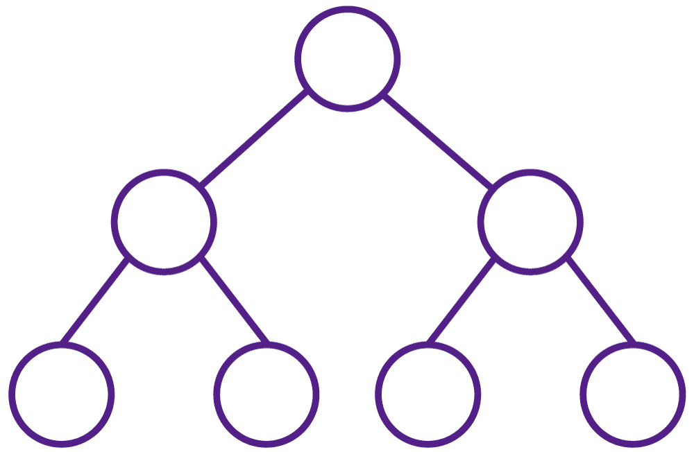

# Estrutura de dados: Listas
## Estruturas de dados
### O que são essas estruturas?
As estruturas de dados nos ajudam a organizar e gerenciar informações. Exemplos de estruturas são listas, pilhas e filas.

### Qual a finalidade de estruturar dados?
Por exemplo, as listas podem se adaptar a qualquer coisa que você escreva nelas, você pode adicionar, remover e reorganizar itens facilmente. Já as pilhas você só pode pegar o último que foi colocado. E as filas o primeiro item que chega é o primeiro a sair.

## Por que aprender estruturas de dados?
Aprender sobre estruturas de dados é como descobrir novas ferramentas que nos ajudam a organizar e entender informações de forma mais eficiente.

Da mesma forma, as estruturas de dados nos permitem organizar e manipular dados de maneira precisa, tornando a resolução de problemas de programação mais acessível e gratificante. 

Veja a seguir pontos específicos para te ajudar a entender a importância real das estruturas de dados: 

- **Eficiência:** estruturas de dados adequadas podem melhorar significativamente o desempenho de um programa, reduzindo o tempo de execução e o consumo de recursos.
- **Organização:** as estruturas de dados ajudam a organizar e gerenciar grandes volumes de dados de forma eficiente, fornecendo métodos para inserir, acessar, atualizar e excluir dados de maneira organizada e estruturada.
- **Resolução de problemas:** Ao aprender sobre diferentes estruturas de dados e seus algoritmos associados, os desenvolvedores adquirem uma gama de ferramentas para resolver uma variedade de problemas de programação. Isso os capacita a abordar desafios complexos de forma mais eficaz e elegante. Com a organização, a facilidade que temos para resolver problemas se torna muito maior.  
- **Flexibilidade:** Compreender diversas estruturas de dados oferece flexibilidade para escolher a melhor abordagem para resolver um problema específico. Cada estrutura de dados tem suas próprias vantagens e limitações e conhecer várias opções permite adaptar a solução conforme necessário. Para resolvermos problemas complexos, necessitamos de flexibilidade e adaptabilidade.
- **Fundamental para entrevistas técnicas:** Muitas entrevistas para vagas de desenvolvedor incluem perguntas sobre estruturas de dados e algoritmos. Portanto, ter um conhecimento sólido nessa área é essencial para se destacar no mercado de trabalho. Com todos os recursos de estruturas você ficará mais preparado para entrevistas técnicas profissionais.

## Estrutura de dados: Listas
### Principais estruturas de dados 
Principais estruturas de dados: 

- listas, 
- pilhas, 
- filas; e
- árvores.

> **Imagine uma lista como uma sequência de elementos, onde cada elemento 
possui uma posição definida...**

Assim como uma lista de compras, você pode adicionar itens, removê-los ou até mesmo reorganizá-los conforme necessário. As listas são extremamente versáteis e podem ser usadas em uma variedade de situações, desde armazenar dados simples até representar informações mais complexas.

## Estrutura de dados: Pilhas
Uma pilha é uma estrutura de dados que segue o princípio LIFO (Last In, First Out), ou seja, o último elemento adicionado é o primeiro a ser removido. 

Em Python, você pode implementar uma pilha utilizando uma lista. Os métodos embutidos append() e pop() são utilizados para adicionar e remover elementos da pilha, respectivamente. Ao adicionar um elemento, ele se torna o topo da pilha, e, ao remover um elemento, o elemento no topo é removido.

As pilhas são muito úteis em diversas tarefas. Por exemplo, elas podem ser usadas para desfazer ações em um aplicativo, permitindo que você desfaça ações na ordem inversa em que foram feitas. Além disso, as pilhas são frequentemente utilizadas na avaliação de expressões matemáticas, como a conversão de uma expressão na notação infixada para a notação pós-fixa (ou reversa polonesa).

---

#### CURIOSIDADE

Na notação polonesa reversa, você coloca os números primeiro e depois o sinal de operação. Por exemplo, em vez de escrever 2 + 3, você escreve 2 3 +. É como se você estivesse dizendo "dois mais três". Essa forma de escrever as contas é útil porque não precisa se preocupar com a ordem das operações. Você sempre faz a operação com os dois últimos números que aparecem.

Por exemplo, se você tiver a conta 2 3 +, você pega os dois últimos números (2 e 3) e soma: 

2 + 3 = 5

---

Ao utilizar pilhas, é importante lembrar que, ao adicionar elementos, eles serão colocados no topo da pilha e, ao remover elementos, o elemento no topo será removido primeiro. Esse comportamento "last in, first out" é fundamental para a manipulação correta da pilha. 

## Estrutura de dados: Fila
As filas seguem o princípio FIFO, ou seja, First-In-First-Out. Isso significa que o primeiro elemento a entrar na fila será o primeiro a sair. Quem entra em primeiro será o primeiro a sair.

Vamos explorar como implementar filas em Python, conhecer algumas bibliotecas úteis e aprender sobre as principais operações em filas, como enfileirar (adicionar elementos) e desenfileirar (remover elementos). Além disso, vamos conhecer várias situações do mundo real em que as filas são utilizadas, desde a gestão de processos em sistemas operacionais até o gerenciamento de tarefas em aplicativos de mensagens.

Na programação, esse conceito se traduz em garantir que o primeiro elemento adicionado à fila seja o primeiro a ser processado ou removido. Isso é essencial para muitos algoritmos e estruturas de dados que dependem da ordem de chegada dos elementos

## Estrutura de dados: Árvores
Uma árvore é uma estrutura de dados hierárquica amplamente utilizada em ciência da computação. Ela consiste em nós interconectados por arestas, onde cada nó tem um único nó pai (exceto o nó raiz) e pode ter vários nós filhos.

Aqui estão alguns termos-chave relacionados a árvores:

- **Nó:** cada elemento individual em uma árvore é chamado de nó. Um nó pode conter dados ou referências a dados;
- **Nó Raiz:** é o nó superior da árvore e é o ponto de partida para todas as operações na árvore;
- **Nó Filho:** são os nós que estão diretamente conectados a um nó pai;
- **Nó Pai:** é o nó que possui um ou mais nós filhos;
- **Folha:** são os nós que não têm filhos, ou seja, são os nós terminais da árvore;
- **Subárvore:** é uma árvore que consiste em um nó e todos os seus descendentes;
- **Altura da Árvore:** a altura de uma árvore é o comprimento do caminho mais longo da raiz até uma folha;
- **Grau de um Nó:** o grau de um nó é o número de filhos que ele possui.

