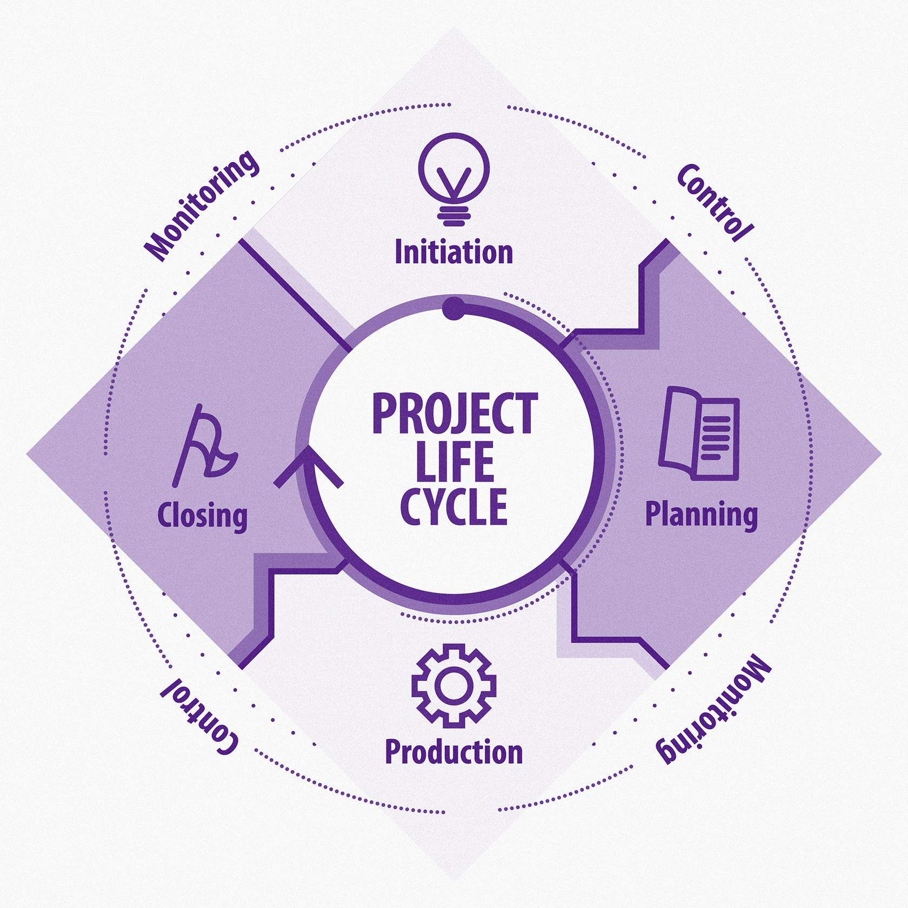
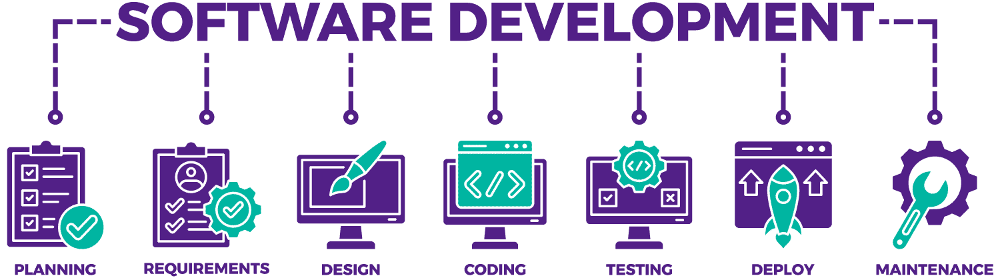

# Análise de sistemas
## Papel e Importância da Análise de Sistemas
A análise de sistemas desempenha um papel crucial em todas as fases do ciclo de vida do desenvolvimento de software. Entre suas principais funções, destacam-se:
1. **Entendimento das necessidades do usuário:** os analistas de sistemas trabalham em estreita colaboração com os stakeholders para identificar e compreender as necessidades do sistema a ser desenvolvido. Isso envolve a realização de entrevistas, workshops e outras técnicas de levantamento de requisitos.
2. **Especificação de requisitos:** com base nas informações coletadas, os analistas de sistemas documentam os requisitos do sistema de forma clara e concisa. Isso inclui requisitos funcionais (o que o sistema deve fazer) e requisitos não funcionais (qualidade, desempenho, segurança etc.).
3. **Modelagem do sistema:** a análise de sistemas também envolve a criação de modelos que representam diferentes aspectos do sistema, como seus processos de negócio, estrutura de dados e interações com os usuários. Esses modelos ajudam a visualizar e entender o sistema antes de sua implementação.
4. **Validação e verificação de requisitos:** antes de prosseguir para a fase de desenvolvimento, os requisitos do sistema são validados e verificados para garantir que sejam completos, consistentes e compreensíveis. Isso ajuda a evitar erros e retrabalho durante o desenvolvimento.

> **CURIOSIDADE**
O ciclo de vida do desenvolvimento de software é como o ciclo de vida de qualquer projeto, isto é, possui etapas distintas, desde a concepção até a entrega do produto final. Uma curiosidade interessante é que existem várias metodologias para o ciclo de vida do desenvolvimento de software, cada uma com suas próprias abordagens e ênfases. Alguns exemplos incluem o modelo em cascata, o modelo iterativo e incremental, e metodologias ágeis como Scrum e Kanban. Cada uma dessas metodologias tem suas vantagens e desvantagens, e a escolha da mais adequada depende das necessidades e características específicas de cada projeto. 

## Essencial para o seu sucesso
A análise de sistemas é essencial para o sucesso de um projeto de software por várias razões, vejamos algumas delas:
1. **Alinhamento com as necessidades do negócio:** a análise de sistemas permite uma compreensão profunda das necessidades dos usuários e das metas do negócio, garantindo que o software desenvolvido atenda às expectativas e traga benefícios tangíveis para a organização.
> **Exemplo:** imagine uma empresa de comércio eletrônico que deseja desenvolver um novo sistema de gerenciamento de pedidos. Através da análise de sistemas, os analistas podem identificar as funcionalidades essenciais que irão melhorar a experiência do usuário, como um processo de checkout simplificado e um sistema de rastreamento de pedidos em tempo real.
2. **Redução de riscos e custos:** uma análise rigorosa dos requisitos ajuda a identificar problemas precocemente, reduzindo assim os riscos e os custos associados a mudanças tardias no projeto.
> **Exemplo:** durante a análise de um sistema de gerenciamento de estoque, os analistas podem descobrir que uma determinada funcionalidade é complexa de implementar ou não atende adequadamente às necessidades dos usuários. Identificar esses problemas no início do projeto permite que sejam feitos ajustes antes que o desenvolvimento avance muito, economizando tempo e recursos.
3. **Melhoria da Comunicação:** a documentação clara dos requisitos e modelos de sistema facilita a comunicação entre os stakeholders do projeto, incluindo desenvolvedores, clientes e gerentes.
> **Exemplo:** em um projeto de desenvolvimento de um sistema de folha de pagamento, uma análise de sistemas bem conduzida resultará em uma documentação detalhada dos requisitos. Isso inclui fluxogramas e diagramas de caso de uso que ajudam a esclarecer as funcionalidades do sistema para todos os envolvidos, garantindo que todos estejam alinhados e que as expectativas sejam bem gerenciadas.

## A Análise de Sistemas
Análise de sistemas desempenha um papel crítico na criação de software de qualidade, ajudando a garantir que os sistemas desenvolvidos atendam às necessidades dos usuários e às metas do negócio, além de manutenções, sustentações e suportes serem desenvolvidos de forma muito mais concisa e eficiente. Pense que você estará apto a trabalhar em várias equipes, ou até mesmo receber oportunidades para outras empresas. 

#### Pense comigo... 

- Se você leva o conhecimento adquirido, sem ter realizado uma documentação, como a equipe que te substituiu vai conseguir trabalhar?
- Sem documentação prévia, como gerar a eficiência que é necessária? 

Você gostaria de entrar em uma nova oportunidade que muito te agrade e que você tenha capacidade de mostrar rapidamente resultado para a empresa, entretanto não há documentação alguma e nenhuma outra pessoa para realizar essa transferência de conhecimento para você? 

Um profissional de excelência não é avaliado apenas pelo seu conhecimento técnico, e sim por características éticas e valores morais também.

## Ciclo de vida de desenvolvimento de sistemas
O ciclo de vida de desenvolvimento de sistemas é o processo pelo qual um sistema de informação é concebido, desenvolvido e implementado. Ele consiste em várias etapas que abrangem desde a concepção até a entrega do sistema funcional. Essas etapas consistem, geralmente, em: 

#### LEVANTAMENTO DE REQUISITOS
Esta é a fase inicial do ciclo de vida, na qual as necessidades do sistema são identificadas e documentadas. Os stakeholders são entrevistados e várias técnicas são utilizadas para entender completamente os requisitos do sistema.

#### ANÁLISE
Na fase de análise, os requisitos identificados na fase anterior são analisados em detalhes. Modelos e diagramas são criados para representar as funcionalidades do sistema de forma clara e compreensível.

#### PROJETO
Após a análise, o projeto do sistema é desenvolvido. Isso envolve a definição da arquitetura do sistema, a seleção das tecnologias a serem utilizadas e a criação de especificações técnicas detalhadas.

#### IMPLEMENTAÇÃO
Nesta fase, o sistema é construído com base no projeto elaborado anteriormente. Os desenvolvedores escrevem o código-fonte e integram as diferentes partes do sistema para criar um todo coeso.

#### TESTES
Os testes são realizados para garantir que o sistema desenvolvido atenda aos requisitos especificados. Isso inclui testes de funcionalidade, desempenho, segurança e usabilidade.

#### IMPLANTAÇÃO
Após a conclusão dos testes, o sistema é implantado no ambiente de produção. Isso envolve a instalação do software nos servidores e a configuração para que os usuários finais possam acessá-lo.

#### MANUTENÇÃO
Uma vez em produção, o sistema requer manutenção contínua para corrigir problemas, adicionar novas funcionalidades e garantir que continue atendendo às necessidades dos usuários.

### IMPORTANTE

Entenda que, por mais que estejamos falando de software e isso deveria ser uma ciência exata, a análise de sistemas pode ter suas adaptações. Por exemplo, num ciclo de vida, podemos ter tanto esses sete itens como podemos ter mais, como Planejamento no primeiro item. Isso vai depender de quais níveis hierárquicos estarão envolvidos no projeto e o tamanho dele. Caso seja um projeto com analista e desenvolvedor o ciclo pode até ser menor. Caso envolva desde um Business Owner (a parte de negócios da empresa, que pode até ser um diretor), um gerente de projetos bem definido, um designer, arquitetos de sistemas, analistas e desenvolvedores, o escopo aumenta e talvez a metodologia utilizada seja diferente. Sendo assim, é possível que haja mais pontos nesse ciclo de vida.

## Levantamento de Requisitos
É o processo de identificar, analisar e documentar as necessidades e expectativas dos usuários para um sistema de software. Essas informações são essenciais para garantir que o sistema desenvolvido atenda às necessidades reais dos usuários e aos objetivos do negócio.

### Requisitos Funcionais x Não Funcionais
#### Requisitos funcionais 
Descrevem as funcionalidades específicas que o sistema deve fornecer para atender às necessidades dos usuários. Eles definem o que o sistema deve fazer em termos de entradas, processamento e saídas. Em outras palavras, os requisitos funcionais **especificam as ações que o sistema deve ser capaz de realizar**.

Em um sistema de gerenciamento de biblioteca, os requisitos funcionais podem incluir:

- capacidade de cadastrar novos livros no sistema;
- funcionalidade para emprestar e devolver livros aos usuários;
- sistema de busca para encontrar livros por título, autor ou categoria;
- geração de relatórios de livros emprestados e disponíveis.

#### Requisitos não funcionais 
São atributos de qualidade ou restrições que o sistema deve atender. Eles não descrevem o que o sistema faz, mas sim como ele faz. Os requisitos não funcionais dizem respeito a características como desempenho, segurança, usabilidade, confiabilidade, entre outros.

Para o mesmo sistema de gerenciamento de biblioteca, os requisitos não funcionais podem incluir:

- tempo máximo de resposta para uma busca de livro;
- nível de segurança necessário para proteger dados dos usuários;
- interface de usuário intuitiva e fácil de usar;
- disponibilidade do sistema de 99,9% do tempo.

Esses dois tipos de requisitos são essenciais para garantir que o sistema desenvolvido atenda às necessidades dos usuários de forma eficaz e satisfatória, tanto em termos de funcionalidades quanto de qualidade e desempenho.

## Técnicas de levantamento de requisitos
Para garantir que os requisitos funcionais e não funcionais sejam identificados de forma abrangente e precisa, é fundamental empregar técnicas de levantamento de requisitos. Essas técnicas permitem uma compreensão detalhada das necessidades dos usuários, stakeholders e do contexto do sistema em desenvolvimento. Vamos explorar algumas das principais técnicas utilizadas.

#### Entrevistas
As entrevistas são uma das técnicas mais diretas e eficazes para coletar informações sobre os requisitos do sistema. Elas envolvem conversas diretas com usuários, stakeholders e especialistas relevantes, permitindo explorar suas necessidades, expectativas e restrições de forma detalhada. Durante as entrevistas, é possível esclarecer dúvidas, obter insights valiosos e garantir que nenhum aspecto importante seja deixado de fora. 

#### Questionários
Os questionários são uma ferramenta útil para coletar informações de uma ampla base de usuários de forma padronizada e eficiente. Eles permitem obter uma visão geral das necessidades, preferências e opiniões dos usuários sobre o sistema em desenvolvimento. Ao enviar questionários bem elaborados, é possível alcançar muitos participantes e coletar dados quantitativos que podem complementar as informações obtidas por outras técnicas. As perguntas que foram sugeridas na entrevista podem ser utilizadas também no questionário.

#### Observação
A observação envolve a análise direta das atividades dos usuários em seu ambiente de trabalho. Ao observar os usuários enquanto eles realizam suas tarefas cotidianas é possível identificar padrões de comportamento, necessidades não declaradas e oportunidades de melhoria no sistema. A observação direta proporciona insights valiosos sobre o contexto de uso do sistema e pode revelar aspectos que os usuários podem não ser capazes de articular durante uma entrevista ou questionário. Aqui se trabalha de forma passiva, indireta, com os atores do sistema. Mas algumas ações de exemplo, como abaixo demonstradas, podem ser tomadas.

- **Como os usuários interagem com o sistema atual durante o processo de registro de novos clientes?**

Observar os passos específicos que os usuários realizam ao inserir informações de novos clientes no sistema pode revelar pontos de atrito ou ineficiências no processo.

- **Quais são as etapas mais frequentemente realizadas pelos usuários durante a busca de produtos no sistema?**

Observar os padrões de navegação dos usuários enquanto eles buscam por produtos pode fornecer insights sobre a eficácia do sistema em apresentar informações relevantes e facilitar a descoberta de produtos.

---

### [REGISTRO] Entrevistas

- **Quais seriam as perguntas que você realizaria para as pessoas envolvidas, a fim de obter como resultados os requisitos de um sistema?**

#### EXEMPLOS DE PERGUNTAS

1. Quais são as principais atividades que você realiza em seu dia a dia relacionadas ao sistema que estamos desenvolvendo?

Esta pergunta visa entender as principais tarefas e processos que os usuários realizam e que serão impactados pelo sistema em desenvolvimento. Isso ajuda a identificar as funcionalidades e requisitos específicos que são mais importantes para os usuários.

2. Quais são os maiores desafios ou dificuldades que você enfrenta ao realizar essas atividades atualmente?

Esta pergunta busca identificar as dores e pontos problemáticos que os usuários encontram em seus processos atuais. Ao entender esses desafios, podemos garantir que o sistema em desenvolvimento aborde essas necessidades de forma eficaz e ofereça soluções para os problemas existentes.

3. Que recursos ou funcionalidades você gostaria de ver no novo sistema para facilitar suas atividades e melhorar sua experiência de uso?

Esta pergunta visa explorar as expectativas e sugestões dos usuários em relação ao novo sistema. Ao obter insights sobre as funcionalidades desejadas e os recursos que os usuários consideram importantes, podemos garantir que o sistema atenda às suas necessidades e expectativas de forma satisfatória.

---