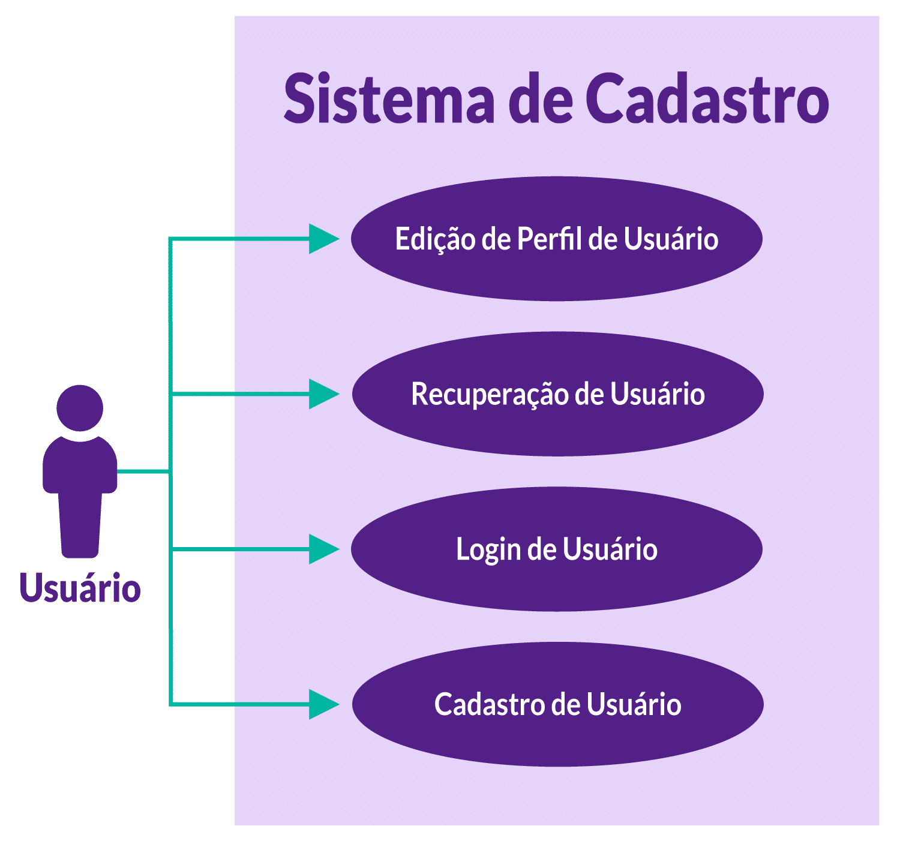

# Especificação de requisitos
## INTRODUÇÃO
Você irá realizar o levantamento de requisitos de um sistema simples de cadastro de clientes.

#### Requisitos funcionais
- Cadastro de Usuário: permitir que os usuários se cadastrem fornecendo nome, e-mail e senha.
- Login de Usuário: permitir que os usuários façam login usando seu e-mail e senha.
- Recuperação de Usuário: permitir que os usuários recuperem suas informações de login.
- Edição de Perfil de Usuário: permitir que os usuários editem suas informações pessoais, incluindo nome, e-mail e senha.

#### Requisitos Não-Funcionais
- Desempenho: o sistema deve ser responsivo e fornecer tempos de resposta rápidos, mesmo durante picos de tráfego.
- Segurança: o sistema deve ser responsivo e fornecer tempos de resposta rápidos, mesmo durante picos de tráfego.

## [REGISTRO] Documento de Especificação de Requisitos

Agora, com seu bloco de notas ou word aberto, coloque um título como “Documento de Especificação de Requisitos” e insira os requisitos funcionais e não-funcionais que você pretende catalogar.

- **Quais seriam os requisitos funcionais e não funcionais no caso de um sistema de cadastro de clientes?**

## Diagrama de Casos de Uso
Os diagramas de casos de uso são importantíssimos para mostrar de forma mais intuitiva a todos os participantes dos projetos quais ações o sistema deve ser permissível a atingir, ou seja, os requisitos funcionais.

Primeiro, entenda conceitos de casos de usos e atores.

#### CASOS DE USO

1. São como histórias que mostram como as pessoas usam o sistema.
2. Descrevem as diferentes maneiras de interação entre usuários e sistema.
3. Cada caso de uso conta uma história específica sobre uma ação que um usuário realiza no sistema.

Por exemplo: "Registrar Cliente", "Fazer Login", "Editar Perfil".

#### ATORES

1. São os personagens principais dessas histórias.
2. Representam quem interage com o sistema.
3. Podem ser pessoas, outros sistemas ou até mesmo dispositivos.
4. Cada ator tem suas próprias histórias (casos de uso) no sistema.

Por exemplo: "Cliente", "Administrador", "Sistema de Pagamento".

**Resumindo, os casos de uso são as histórias que mostram como o sistema é usado e os atores são os personagens principais dessas histórias, representando quem usa o sistema.**

Agora, seguindo os seguintes requisitos funcionais que foram criados (ou se você quiser seguir os que você criou por si só, tudo bem):

- Cadastro de Usuário: permitir que os usuários se cadastrem fornecendo nome, e-mail e senha.
- Login de Usuário: permitir que os usuários façam login usando seu e-mail e senha.
- Recuperação de Usuário: permitir que os usuários, em caso de haver esquecido sua senha, possam reaver seus dados de login. Exemplo: o famoso “esqueceu sua senha?” que há quando tentamos realizar um login em algum site e nossa senha foi alterada.
- Edição de Perfil de Usuário: permitir que os usuários editem suas informações pessoais, incluindo nome, e-mail e senha.

## [REGISTRO] Diagrama de caso de uso
Geraremos o diagrama de caso de uso da seguinte forma – utilize a ferramenta que mais é confortável pra você, como mencionei anteriormente. O importante é que fique claro para as pessoas envolvidas no projeto entender o que são os **atores** e quem são os **casos de uso**.

- Crie um ator com o texto usuário logo abaixo. A imagem se caracteriza por uma pessoa feito por palitinhos e um círculo redondo sendo sua cabeça.
- Faça um retângulo grande, e insira o título Sistema de Cadastro. - Aqui ficarão nossos casos de uso.
- Para cada caso de uso, crie uma elipse e insira cada um. Ex: Edição, Recuperação. Tudo que foi descrito anteriormente aqui:

- Cadastro de Usuário: permitir que os usuários se cadastrem fornecendo nome, e-mail e senha.
- Login de Usuário: permitir que os usuários façam login usando seu e-mail e senha.
- Recuperação de Usuário: permitir que os usuários, em caso de haver esquecido sua senha, pode reaver seus dados de login. Exemplo: O famoso “esqueceu sua senha?” que há quando tentamos realizar um login em algum site, e nossa senha foi alterada.
- Edição de Perfil de Usuário: permitir que os usuários editem suas informações pessoais, incluindo nome, e-mail e senha.
 
#### RESULTADO DO MODELO 1
Você tem o usuário como ator, o retângulo significa o nosso sistema e cada elipse significa um caso de uso. Não ignore as flechas, pois em algumas situações podemos ter mais de um ator, por exemplo, um administrador.

Agora vamos ampliar um pouco mais:

- insira mais um ator, faça o mesmo procedimento que foi realizado para usuário, apenas atribua o nome administrador;
- insira mais uma elipse e coloque o nome desse caso de uso como Gerenciamento de Usuários.

#### RESULTADO DO MODELO 2
Agora temos mais um ator, chamado **Administrador**, que realiza o **Gerenciamento de Usuários**¸ que se torna mais um caso de uso no nosso sistema. Caso necessitemos inserir esse caso de uso, é interessante atualizar no nosso documento, adicionado:

- _Ator: administrador_ 
- _Caso de Uso: permitir o sistema autorizar um ator a gerenciar os perfis de usuários._ 

Espero que, caso você esteja utilizando a sua própria análise, esteja se alinhando com o que estou descrevendo para você aqui no curso.

## Funções include e extend

