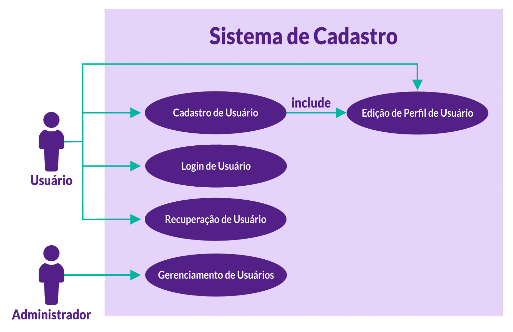
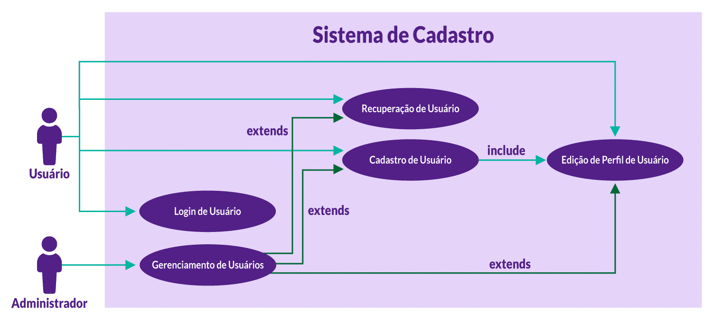
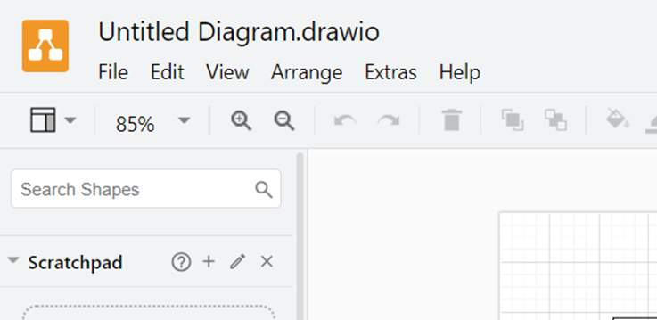
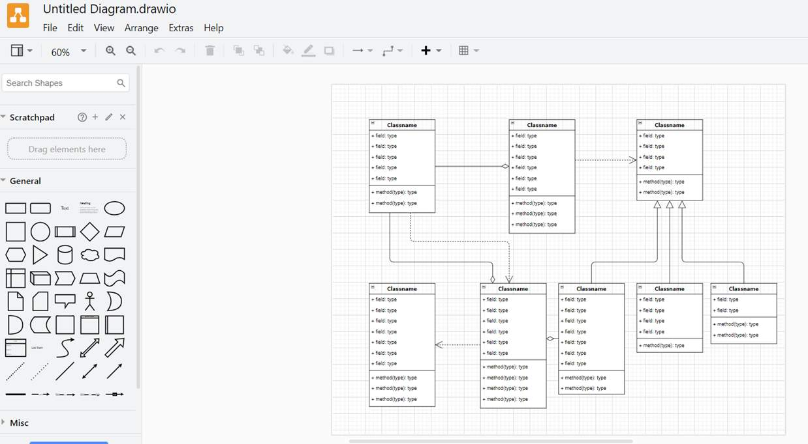
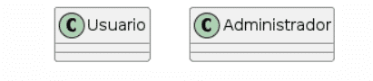
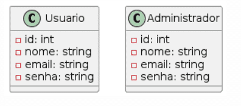
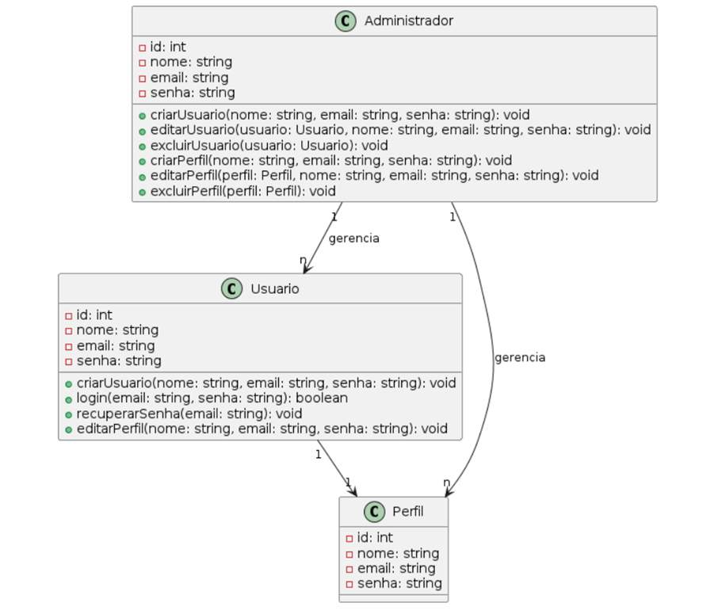

# Especificação de requisitos
## INTRODUÇÃO
Você irá realizar o levantamento de requisitos de um sistema simples de cadastro de clientes.

#### Requisitos funcionais
- Cadastro de Usuário: permitir que os usuários se cadastrem fornecendo nome, e-mail e senha.
- Login de Usuário: permitir que os usuários façam login usando seu e-mail e senha.
- Recuperação de Usuário: permitir que os usuários recuperem suas informações de login.
- Edição de Perfil de Usuário: permitir que os usuários editem suas informações pessoais, incluindo nome, e-mail e senha.

#### Requisitos Não-Funcionais
- Desempenho: o sistema deve ser responsivo e fornecer tempos de resposta rápidos, mesmo durante picos de tráfego.
- Segurança: o sistema deve ser responsivo e fornecer tempos de resposta rápidos, mesmo durante picos de tráfego.

## [REGISTRO] Documento de Especificação de Requisitos

Agora, com seu bloco de notas ou word aberto, coloque um título como “Documento de Especificação de Requisitos” e insira os requisitos funcionais e não-funcionais que você pretende catalogar.

- **Quais seriam os requisitos funcionais e não funcionais no caso de um sistema de cadastro de clientes?**

## Diagrama de Casos de Uso
Os diagramas de casos de uso são importantíssimos para mostrar de forma mais intuitiva a todos os participantes dos projetos quais ações o sistema deve ser permissível a atingir, ou seja, os requisitos funcionais.

Primeiro, entenda conceitos de casos de usos e atores.

#### CASOS DE USO

1. São como histórias que mostram como as pessoas usam o sistema.
2. Descrevem as diferentes maneiras de interação entre usuários e sistema.
3. Cada caso de uso conta uma história específica sobre uma ação que um usuário realiza no sistema.

Por exemplo: "Registrar Cliente", "Fazer Login", "Editar Perfil".

#### ATORES

1. São os personagens principais dessas histórias.
2. Representam quem interage com o sistema.
3. Podem ser pessoas, outros sistemas ou até mesmo dispositivos.
4. Cada ator tem suas próprias histórias (casos de uso) no sistema.

Por exemplo: "Cliente", "Administrador", "Sistema de Pagamento".

**Resumindo, os casos de uso são as histórias que mostram como o sistema é usado e os atores são os personagens principais dessas histórias, representando quem usa o sistema.**

Agora, seguindo os seguintes requisitos funcionais que foram criados (ou se você quiser seguir os que você criou por si só, tudo bem):

- Cadastro de Usuário: permitir que os usuários se cadastrem fornecendo nome, e-mail e senha.
- Login de Usuário: permitir que os usuários façam login usando seu e-mail e senha.
- Recuperação de Usuário: permitir que os usuários, em caso de haver esquecido sua senha, possam reaver seus dados de login. Exemplo: o famoso “esqueceu sua senha?” que há quando tentamos realizar um login em algum site e nossa senha foi alterada.
- Edição de Perfil de Usuário: permitir que os usuários editem suas informações pessoais, incluindo nome, e-mail e senha.

## [REGISTRO] Diagrama de caso de uso
Geraremos o diagrama de caso de uso da seguinte forma – utilize a ferramenta que mais é confortável pra você, como mencionei anteriormente. O importante é que fique claro para as pessoas envolvidas no projeto entender o que são os **atores** e quem são os **casos de uso**.

- Crie um ator com o texto usuário logo abaixo. A imagem se caracteriza por uma pessoa feito por palitinhos e um círculo redondo sendo sua cabeça.
- Faça um retângulo grande, e insira o título Sistema de Cadastro. - Aqui ficarão nossos casos de uso.
- Para cada caso de uso, crie uma elipse e insira cada um. Ex: Edição, Recuperação. Tudo que foi descrito anteriormente aqui:

- Cadastro de Usuário: permitir que os usuários se cadastrem fornecendo nome, e-mail e senha.
- Login de Usuário: permitir que os usuários façam login usando seu e-mail e senha.
- Recuperação de Usuário: permitir que os usuários, em caso de haver esquecido sua senha, pode reaver seus dados de login. Exemplo: O famoso “esqueceu sua senha?” que há quando tentamos realizar um login em algum site, e nossa senha foi alterada.
- Edição de Perfil de Usuário: permitir que os usuários editem suas informações pessoais, incluindo nome, e-mail e senha.
 
#### RESULTADO DO MODELO 1
Você tem o usuário como ator, o retângulo significa o nosso sistema e cada elipse significa um caso de uso. Não ignore as flechas, pois em algumas situações podemos ter mais de um ator, por exemplo, um administrador.

Agora vamos ampliar um pouco mais:

- insira mais um ator, faça o mesmo procedimento que foi realizado para usuário, apenas atribua o nome administrador;
- insira mais uma elipse e coloque o nome desse caso de uso como Gerenciamento de Usuários.

#### RESULTADO DO MODELO 2
Agora temos mais um ator, chamado **Administrador**, que realiza o **Gerenciamento de Usuários**¸ que se torna mais um caso de uso no nosso sistema. Caso necessitemos inserir esse caso de uso, é interessante atualizar no nosso documento, adicionado:

- _Ator: administrador_ 
- _Caso de Uso: permitir o sistema autorizar um ator a gerenciar os perfis de usuários._ 

Espero que, caso você esteja utilizando a sua própria análise, esteja se alinhando com o que estou descrevendo para você aqui no curso.

## Funções include e extend
Como funcionam as funções include e extend em um caso de uso?

#### Include (Inclusão):

- indica que um caso de uso depende de outro para ser executado;
- o caso de uso incluído é essencial para o caso de uso principal;
- representado por uma seta tracejada apontando para o caso de uso incluído.

#### Extend (Extensão):

- indica funcionalidades opcionais que podem ser adicionadas a um caso de uso;
- o caso de uso estendido não é afetado se a extensão não for utilizada;
- é representado por uma seta tracejada apontando para o caso de uso de extensão.

Um exemplo plausível seria que, a partir do caso de uso Cadastro de Usuário, você é obrigado a realizar o caso de uso Edição de Perfil de Usuário. Assim sendo, uma conexão entre esses dois é feita pelo conector Include. 

#### Importante
Agora o caso de uso Edição de Perfil de Usuário pode ser acessado direto do ator Usuário ou sua origem pode ser pelo Cadastro de Usuário. Lembrar que o Include quer dizer que a partir do primeiro caso de uso a ser acionado, o segundo também, obrigatoriamente, deverá ser executado.

Para utilizar o exclude as ações podem ser subsequentes, mas não obrigatórias, vide:

Entenda que aqui o administrador, quando executa o caso de uso Gerenciamento de Usuários, ele pode OU não executar tanto o cadastro de usuários, edição ou recuperação. Mas reforço, um caso de uso não depende do outro, eles são apenas ligados. O Administrador só poderá executar esses 3 a partir de quem executou o caso de uso Gerenciamento de Usuários.

## Diagrama de Classe
Agora entraremos na parte final, mas não menos importante, da documentação de análise de sistemas: O Diagrama de Classe. Nessa nova etapa, os Diagramas de Classes são uma ferramenta fundamental na modelagem de sistemas orientados a objetos, eles fornecem uma representação visual das classes do sistema, seus atributos, métodos e relacionamentos entre si. Tem como componentes principais: 

#### Classe
- Representa uma entidade no sistema, geralmente um conceito do mundo real.
- Possui atributos que descrevem suas características e métodos que definem seu comportamento.
- Exemplo: usuário, produto, pedido.

#### Atributo
- Representa uma característica da classe.
- Pode ser qualquer tipo de dado, como inteiro, string, booleano etc.
- Exemplo: nome, e-mail, idade.

#### Método
- Representa uma ação que a classe pode realizar.
- Define o comportamento da classe e como ela interage com outras classes.
- Exemplo: criarUsuario(), editarPerfil(), calcularTotal().]

#### Relacionamento
- Define como as classes estão associadas umas com as outras.
- Pode ser de diferentes tipos, como associação, composição, agregação, herança etc.
- Exemplo: usuário tem um perfil, pedido é composto por ItemPedido.

## [REGISTRO] Criando classes
Pensando no nosso sistema de cadastro de usuários, quais seriam as classes que você criaria?

#### PASSO A PASSO

1. Acesse https://app.diagrams.net/(opens in a new tab). Clique em “File”.

2. Após, clique em New...

3. Procure por “class” e selecione o primeiro da esquerda que aparece e, assim, clique em Create na parte inferior da caixa de diálogo.

4. Assim sendo, você obterá o diagrama de classe que você poderá alterar da forma que quiser.

5. Analisando a explicação dada anteriormente, as entidades no sistema, com conceito no mundo real, são: Usuário e Administrador, que você criará de dentro de retângulos.

6. Agora, você precisará inserir os atributos de cada um.

7. Inserimos atributos genéricos de identificação, como o número de identificação, nome, e-mail e senha.

**IMPORTANTE**

O diagrama de classes é diferente do diagrama de entidade relacionamento. Aqui deixaremos explícitos o que cada classe terá, não utilizaremos chaves primárias e nem estrangeiras. Assim, qualquer parte do projeto, seja técnico ou usuário, entenderá qual o objetivo do nosso desenvolvimento.

8. Com os atributos preenchidos, você poderá passar para parte dos métodos, ou seja, cada função que as entidades podem realizar. O usuário pode criar login, recuperar senha e editar seu perfil. Já o administrador poderá ter funções mais potentes, como criar perfil e excluir perfil de usuário.

**IMPORTANTE**

Os atributos ficam na segunda seção vertical do retângulo e os métodos ficam na terceira! Exemplo: na primeira linha das classes acima temos o nome da entidade, agora convertida em classe. Na segunda linha (seção) temos os atributos, ou seja, características das nossas classes. Já na terceira linha (seção) temos os métodos que cada classe possui, isto é, as ações e, indo mais detalhadamente, os casos de uso que foram convertidos em funções aqui. 

E se estamos falando de perfil de usuário, ou seja, mais detalhes que cada usuário pode ter, podemos também criar uma entidade Perfil.

Para finalizar, criamos os relacionamentos.

 O que será realizado aqui? A ideia de relacionamentos é a mesma do diagrama entidade relacionamento. Podemos ter 1 para 1, 1 para N e N para N.

Nesse caso, um usuário possui um perfil. Um administrador pode gerenciar vários perfis e o administrador pode gerenciar vários usuários!

